<span style="color:red">(蔡昀芸 107062548)</span> 
<center>
<h1>Project 3 / Scene recognition with bag of words</h1>
  
## Overview
The goal of this project is to introduce you to image recognition. Specifically, we will examine the task of scene recognition starting with very simple methods -- tiny images and nearest neighbor classification -- and then move on to techniques that resemble the state-of-the-art -- bags of quantized local features and linear classifiers learned by support vector machines.

## Implementation
1.get_tiny_images.py
Tiny_images simply resizes each image to a small, fixed resolution (we recommend 16x16). It works slightly better if the tiny image is made to have zero mean and unit length. This is not a particularly good representation, because it discards all of the high frequency image content and is not especially shift invariant.
```
    images_features = np.zeros((len(image_paths), 256))
    print(images_features.shape)
    for i in range(1, len(image_paths)):
        im = Image.open(image_paths[i])
        new_im = im.resize((16,16))
        images_features[i,:] = np.reshape(new_im, (1, 256))[0]
        images_features[i,:] = images_features[i,:] - np.mean(images_features[i,:])
        images_features[i,:] = np.divide( images_features[i,:], LA.norm(images_features[i,:]))
```
2. nearest_neighbor_classify.py
Nearest_Neighbor simply finds the "nearest" training example (L2 distance is a sufficient metric) and assigns the test case the label of that nearest training example. The nearest neighbor classifier has many desirable features -- it requires no training, it can learn arbitrarily complex decision boundaries, and it trivially supports multiclass problems.
First, I use distance.cdist() to calculate the similarities between each testing features and training features.
Then, I sort the nearest neighbor distance array with index and output the highst votes to do voting for the classication.
```
    Train_image_feats = np.zeros((1500,400))
    Test_image_feats = np.zeros((1500,400))
    for i in range (1, 1500):
        imgs1 = train_image_feats[i][0]
        imgs2 = test_image_feats[i][0]
        Train_image_feats[i] = imgs1
        Test_image_feats[i] = imgs2

    train_test_dis=distance.cdist(Train_image_feats,Test_image_feats,'euclidean')
    sorted_list=np.argsort(train_test_dis,axis=0)
    test_predicts=itemgetter(*sorted_list[0,:])(train_labels)
```
3. build_vocabulary.py
we first need to create a vocabulary of visual words by sampling local features from our training set. After that,we cluster them with kmeans.The number of kmeans clusters is the size of our vocabulary and the size of our features. For any new SIFT feature we observe, we can figure out which region it belongs to as long as we save the centroids of our original clusters.
```
  bag_of_features = []
  print("Extract SIFT features")
  pdb.set_trace()
  for path in image_paths:
        img = np.asarray(Image.open(path),dtype='float32')
        frames, descriptors = dsift(img, step=[5,5], fast=True)
        bag_of_features.append(descriptors)
  bag_of_features = np.concatenate(bag_of_features, axis=0).astype('float32')
  pdb.set_trace()
  print("Compute vocab")
  start_time = time()
  vocab = kmeans(bag_of_features, vocab_size, initialization="PLUSPLUS")        
  end_time = time()
  print("It takes ", (start_time - end_time), " to compute vocab.")
  return vocab
  ```
4.get_bags_of_sifts.py
After we create the vocab,we can get the euclidian distance between the sift features of images and vocabulary.By building a histogram indicating how many times each centroid used, we can represent the training and testing image features as normalized histograms of visual words.
``` 
    vocab = pickle.load(open('vocab.pkl','rb'))
    image_feats = []

    start_time = time()

    for path_idx in range(len(image_paths)):
        img = np.asarray(Image.open(image_paths[path_idx]),dtype='float32')
        frames,descriptors = dsift(img,step=[5,5],fast=True)
        dist = distance.cdist(descriptors,vocab,'euclidean')
        target_idx = np.argmin(dist,axis=1)
        image_feats.append(np.histogram(target_idx,np.arange(vocab.shape[0] + 1),density=True)[0].reshape([1,-1]))

    image_feats = np.vstack([image_feats])

    end_time = time()
    print("It takes ",(start_time - end_time)," to compute feature.")
```
5. svm_classify.py
```
   Train_image_feats = np.zeros((1500,400))
    Test_image_feats = np.zeros((1500,400))
    for i in range (1, 1500):
        imgs1 = train_image_feats[i][0]
        imgs2 = test_image_feats[i][0]
        Train_image_feats[i] = imgs1
        Test_image_feats[i] = imgs2

    clf = LinearSVC(C=10,class_weight=None,dual=True,fit_intercept=True,
                    intercept_scaling=1,loss='squared_hinge',max_iter=1000,
                    multi_class='ovr',penalty='l2',random_state=0,tol=1e-4,
                    verbose=0)

    clf.fit(Train_image_feats,train_labels)
    pred_label = clf.predict(Test_image_feats)
```

## Experimental Results

<Center>
<table border=0 cellpadding=4 cellspacing=1>
<tr>
  <th colspan=2>Confusion Matrix</th>
</tr>
<tr>
  <td>Tiny image+Nearest neighbor</td>
  <td>0.22733333333333333</td>
  <td bgcolor=LightBlue></td>
</tr>
<tr>
  <td>Bag of sift+Nearest neighbor</td>
  <td> 0.5326666666666666</td>
  <td bgcolor=LightBlue></td>
</tr>
<tr>
  <td>Bag of sift+LinearSVC</td>
  <td> 0.6586666666666666</td>
  <td bgcolor=LightBlue></td>
</tr>
</table>
</center>
## Visualization
| Category name | Sample training images | Sample true positives | False positives with true label | False negatives with wrong predicted label |
| :-----------: | :--------------------: | :-------------------: | :-----------------------------: | :----------------------------------------: |
| Kitchen |  |  | 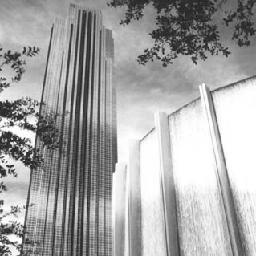 | 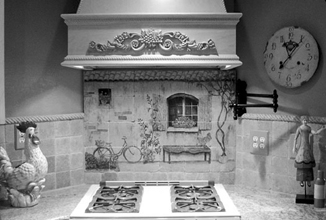 |
| Store | 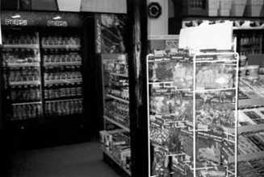 | 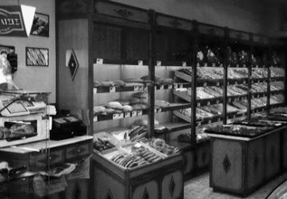 | 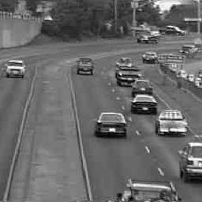 |  |
| Bedroom | 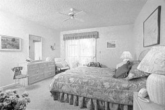 |  |  |  |
| LivingRoom | 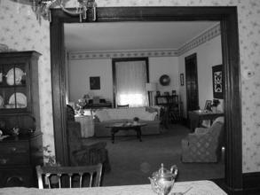 |  | 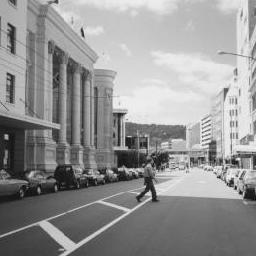 |  |
| Office | 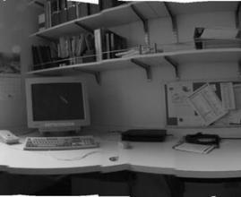 | 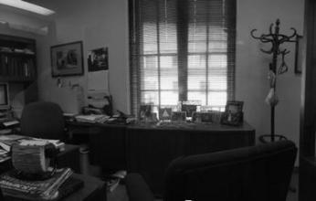 |  | 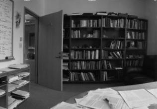 |
| Industrial | 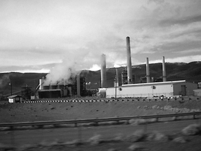 | 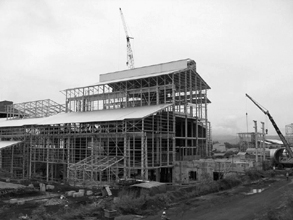 |  |  |
| Suburb | 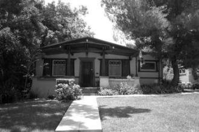 |  |  | 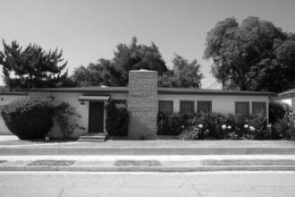 |
| InsideCity |  |  |  |  |
| TallBuilding |  |  | 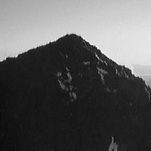 |  |
| Street | 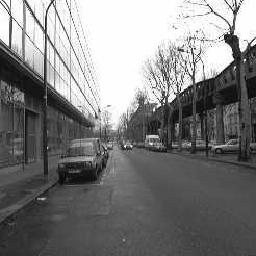 | 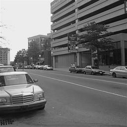 |  |  |
| Highway | 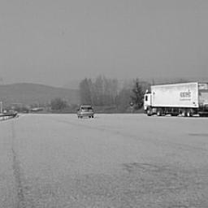 |  | 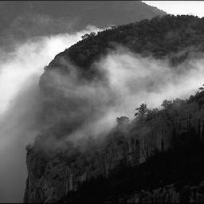 |  |
| OpenCountry | 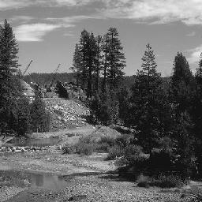 | 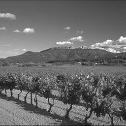 | 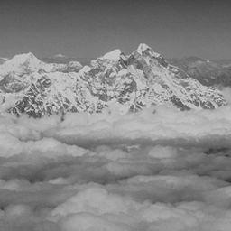 | 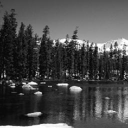 |
| Coast |  | 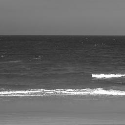 | 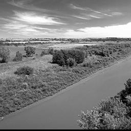 |  |
| Mountain | 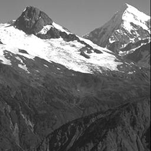 |  |  | 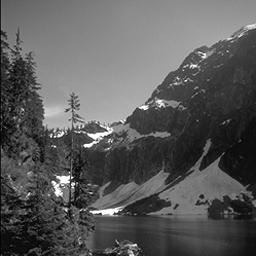 |
| Forest |  |  | 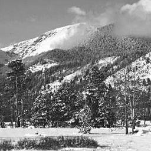 |  |


